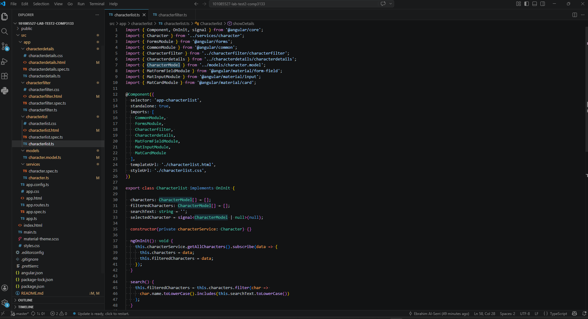

# 101085527 Lab Test 2 Comp3133
Student: Ebrahim Al-Serri
Student ID: 101085527

## Description
This is for Lab Test 2 in COMP3133.
The app displays Harry Potter characters using an API. 

## Features
- Display all characters
- Search characters by name
- Filter characters by house (Gryffindor, Slytherin, etc.)
- Show character details when clicked
- Simple UI using Angular

## How to Run
1. Run `npm install`
2. Run `ng serve`
3. Open `http://localhost:4200/`

## Screenshots

### Home Page  

Displays all harry Potter characters fetched from the API.

### Search Feature 

Shows filtering characters by typing a name in the search box.

### Filter by House

Displays characters filtered by selected house (e.g., Slytherin).

### Character Details

Shows detailed information when a character is selected.

### Code Screenshots

Shows the implementation of Angular component and logic.