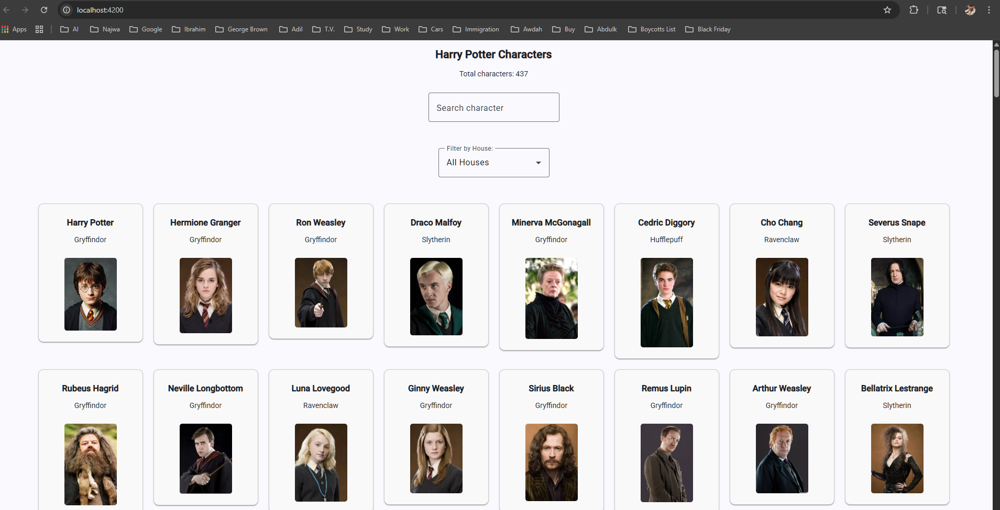
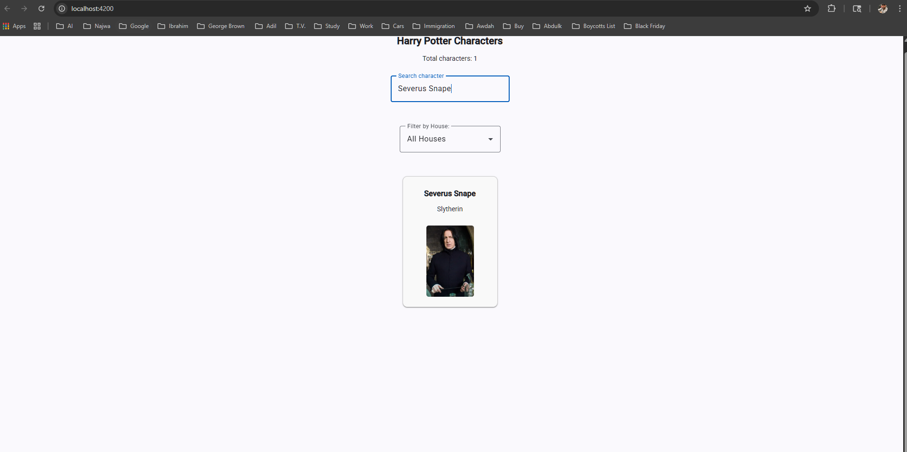
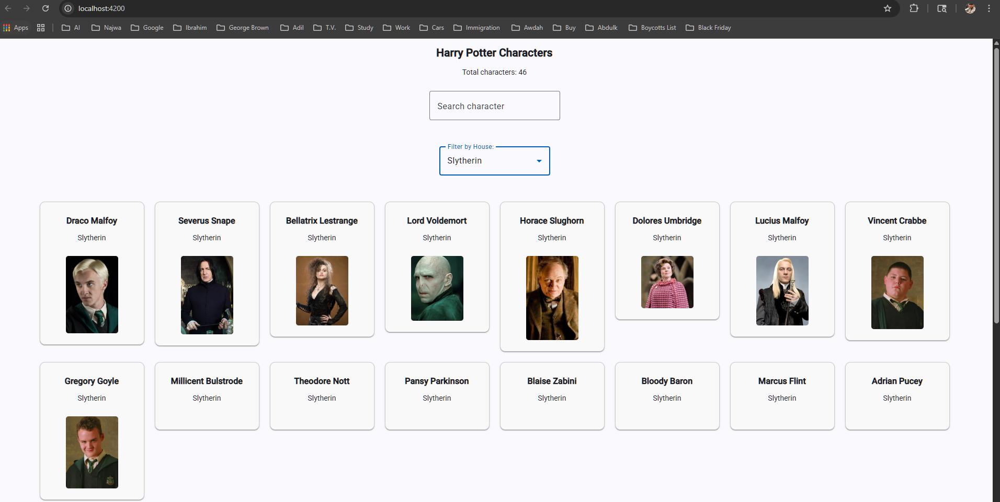
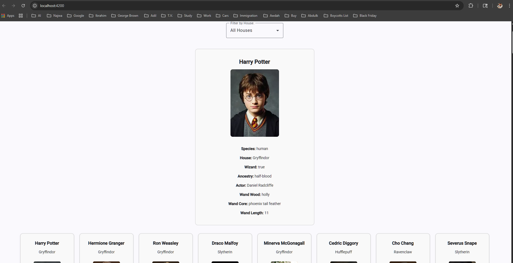

# Harry Potter Character Explorer

An Angular web application that displays and filters Harry Potter characters using a public API.  
The application allows users to browse characters, search by name, filter by house, and view detailed character information through a clean and responsive interface.

---

## Features

- Display all Harry Potter characters
- Real-time search functionality
- Filter characters by Hogwarts house
- Character detail view
- Dynamic API data rendering
- Responsive Angular UI
- Angular Material integration
- Component-based architecture

---

## Tech Stack

- Angular
- TypeScript
- Angular Material
- HTML
- CSS
- REST API

---

## API Used

- https://hp-api.onrender.com/

---

## Installation & Setup

1. Clone the repository

```bash
git clone https://github.com/Ibrahimdur1989/harry-potter-character-explorer.git
```
2. Navigate to the project folder
```bash
cd harry-potter-character-explorer
```
3. Install dependencies
```bash
npm install
```
4. Run the application
```bash
ng serve
```
5. Open in browser
```bash
http://localhost:4200/
```

## Screenshots

### Home Page  

Displays all harry Potter characters fetched from the API.

### Search Feature 

Allows users to search characters dynamically by name.

### Filter by House

Displays characters filtered by selected Hogwarts house (e.g., Slytherin).

### Character Details

Shows detailed information about the selected character.


## Project Structure

```text
src/
│
├── app/
│   ├── characterlist/
│   ├── characterfilter/
│   ├── characterdetails/
│   ├── models/
│   └── services/
│
├── assets/
└── environments/
```

---

## Features Improvements
- Pagination support
- Dark mode
- Advanced filtering
- Favorite characters system
- Authentication
- Improved responsive design


---

## Author

### Ebrahim Al-Serri
Computer Programming & Analysis - Graduate 2026

George Brown College
